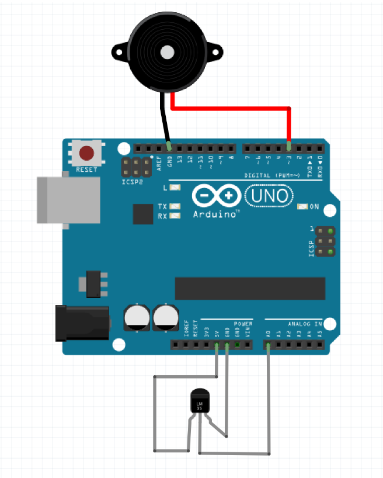

# Fire Alarm

[](https://greenkeeper.io/)

> A Nodebots fire alarm using NodeJS and Johnny-five

[](https://travis-ci.org/willmendesneto/fire-alarm)
[](https://ci.appveyor.com/project/willmendesneto/fire-alarm/branch/master)
[](https://coveralls.io/r/willmendesneto/fire-alarm?branch=master)




## INTRODUCTION

Application using Arduino + Johnny Five + NodeJS for to check if the area is on fire and send you a SMS with alarm message.


## First steps

- [Install Arduino](https://www.arduino.cc/en/Main/Software)
- [Install NodeJS](https://nodejs.org/en/download/)
- [Setup your board](http://johnny-five.io/platform-support/)
- (Optional) Install Johnny-Five Package using ```npm install johnny-five <--global|--save>```


## Usage

```bash
$ git clone <project> && cd $_
$ npm install
$ node index.js # or npm start
```

You will need of:
- 1 Arduino with 2 GND inputs and 2 ports (in this case we are using A0 port + GND port for Termometer sensor and 3 port + GND port for piezo sensor);
- NodeJS;
- Access from internet (for SMS messages API);


## Author

**Wilson Mendes (willmendesneto)**
+ <https://twitter.com/willmendesneto>
+ <http://github.com/willmendesneto>
